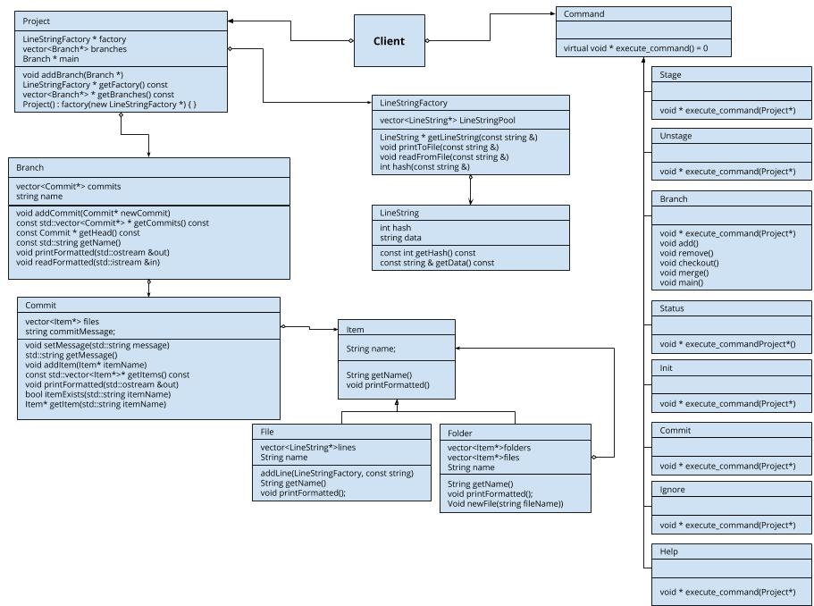
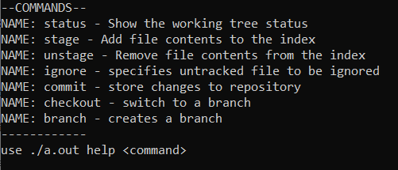
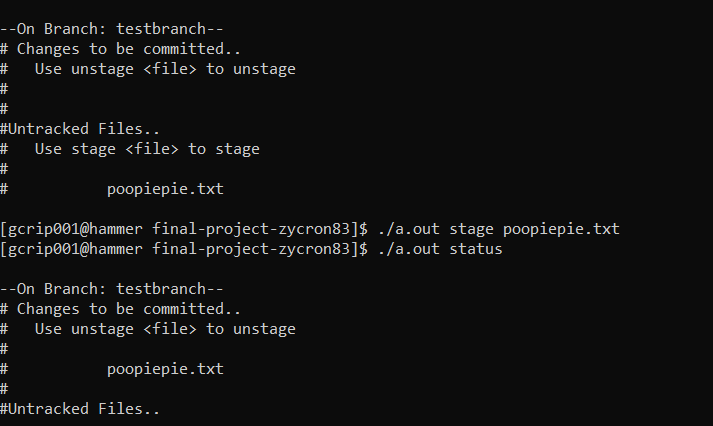
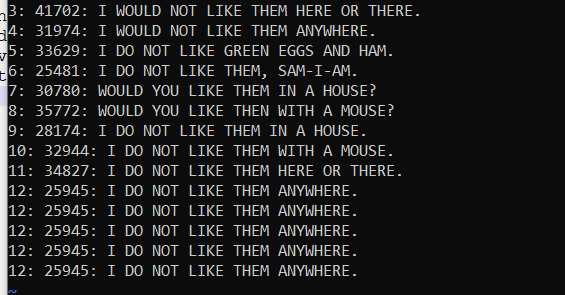
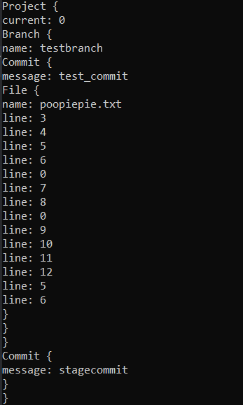

 # Git Recreation
 
 Authors: [Jeremy Cartwright](https://www.github.com/Zycron83), [Garrett Crippen](https://www.github.com/GarrettCrippen), [George Orduno](https://www.github.com/GeorgeO05)
 
 <!-- > You will be forming a group of **TWO - THREE** students and work on an interesting project that you will propose yourself (in this `README.md` document). You can pick any project that you'd like, but it needs ot implement three design patterns. Each of the members in a group is expected to work on at least one design pattern and its test cases. You can, of course, help each other, but it needs to be clear who will be responsible for which pattern and for which general project features.
 
 > ## Expectations
 > * Incorporate **three** distinct design patterns, *two* of the design patterns need to be taught in this course:
 >   * Composite, Strategy, Abstract Factory, Visitor, Iterator
 > * All three design patterns need to be linked together (it can't be three distinct projects)
 > * You can pick any of the following languages:
 >   * C/C++, Java, Python
 > * You can incorporate additional technologies/tools but they must be approved (in writing) by the instructor or the TA
 > * Each member of the group **must** be committing code regularly and make sure their code is correctly attributed to them. We will be checking attributions to determine if there was equal contribution to the project. -->

## Project Description

 This project is going to be our own version control system. It is going to have many of the same features of Git. Since we've been learning how to use git in this class, it would be fun to attempt our own version of it. All the commands we are going to implement are written below. It will be written in C++ and tested on Windows, Ubuntu, and the Hammer Server (CentOS). The input will be a command, and the output will be the command carried out along with any information provided.

 {} = optional parameters
 [] = mandatory parameters
 Commands and their subcommands (may be altered or added to in the future):
   * Branch
      * Add [branch name]
      * Switch [branch name]
      * Merge {branch1 name} [branch2 name]
      * Remove {branch name}
      * Main {branch name}
   * Status
   * Stage [filename/dirname]
   * Commit {-m "..."}
   * Help {subcommand}
   * Init {main branch name}
   * Unstage {filename/dirname}
   * Ignore [filename/dirname]
 
 ### Design Patterns

 #### Strategy
 The strategy pattern will be used to implement the commands. Each command inherits from a base command class with a pure virtual execute_command() function. This allows us to more easily manage and add commands.

 #### Composite
 Both files and directories may be treated the same way. They can be ignored, staged for commit, etc. They can also be treated the same when stored. There will be an Item class that both folders and files inherit from.

 #### Flyweight
 The Flyweight design pattern can be used when dealing with files accross branches to reduce memory consumtion. We can take into consideration that files across branches have most if not all of their contents the same. So we can just store unique lines, so that files can then store pointers to the lines they have, provided by the line factory.

 <!-- > Your project description should summarize the project you are proposing. Be sure to include
 > * Why is it important or interesting to you?
 > * What languages/tools/technologies do you plan to use? (This list may change over the course of the project)
 >   * [toolname](link) - Short description
 > * What will be the input/output of your project?
 > * This description should be in enough detail that the TA/instructor can determine the complexity of the project and if it is sufficient for the team members to complete in the time allotted.  -->

<!--
 > ## Phase II
 > In addition to completing the "Class Diagram" section below, you will need to 
 > * Set up your GitHub project board as a Kanban board for the project. It should have columns that map roughly to 
 >   * TODO, In progress, In testing, Done
 >   * You can change these or add more if you'd like, but we should be able to identify at least these.
 > * There is no requirement for automation in the project board but feel free to explore those options.
 > * Create an "Epic" (note) for each feature and each design pattern and assign them to the appropriate team member.
 > * Break down the first "Epic" into smaller user stories (issues) and assign them to the appropriate team member.
## Class Diagram
 > Include a class diagram and a description of the diagram. This should be in sufficient detail that another group could pick up the project this point and successfully complete it.
 -->
 
 ## Description: 
   Commands are implemented in a strategy pattern on the right. The files are stored in a composite pattern on the bottom. The lines of files are stored via a flyweight pattern in the center. The factory will provide a pointer to a line of text in its pool when given a line. Files need then store a vector of pointers rather than the entire contents, saving space.
 <!--
 > ## Phase III
 > You will need to schedule two check-in's with the TA (during lab hours or office hours) where your entire group will meet with them and discuss:
 > * What you have each done up to this point
 > * What you plan to do until the next meeting (or until the final demo)
 > * If there is anything that is getting in your way
 
 > You may notice that this is effectively a "standup" meeting. We suggest that as a team you have a daily (or every other day) standup, but this will be a bit more formal with the TA. 
 
 > **Your meetings cannot be in the same week of the session so plan ahead**

-->
 ## Final deliverable:
 ## Screenshots
 
 
 
 
 
 ## Installation/Usage
  First compile: g++ Main.cpp. Init the repository with ./a.out init. To see avaliable commands use ./a.out help 
 
 ## Testing
  We tested each function seperately, using seperate test files. G test helped with some of the testing.
 
 ## Things planned for the 3rd sprint
	 Add windows compatibility: dirent.h is not compatible with windows
	 overwrite files upon checkout
	 stage/unstage multiple files and folders in one command line argument
 <!--	 
